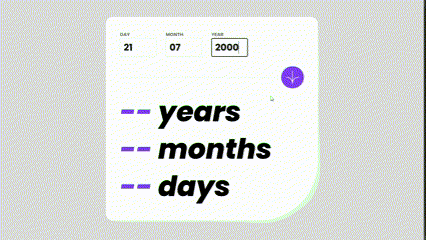
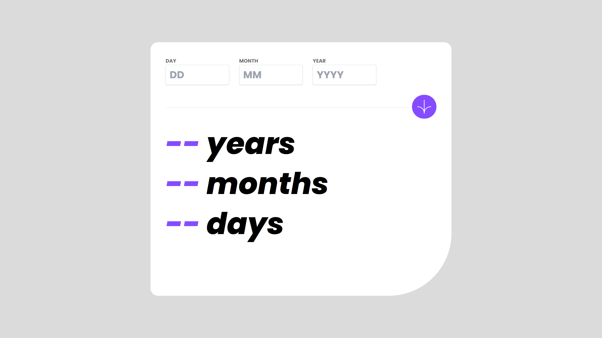
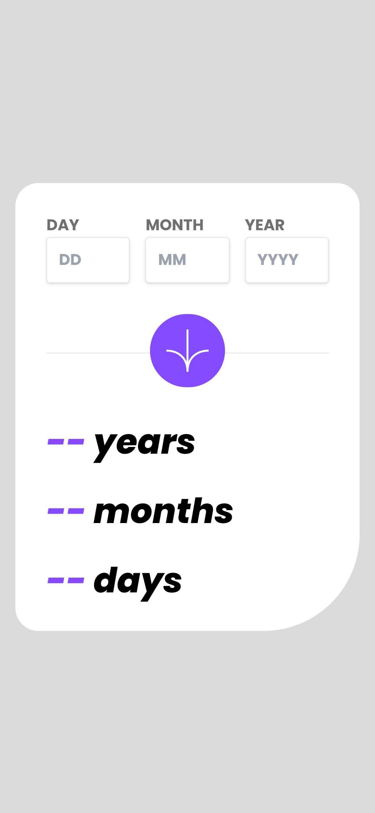

# Frontend Mentor - Age calculator

## Table of contents

- [Overview](#overview)
  - [The challenge](#the-challenge)
  - [Screenshots](#screenshots)
  - [Links](#links)
- [My process](#my-process)
  - [What I learned](#what-i-learned)
  - [Possible upgrades](#possible-upgrades)

## Overview

### The challenge

The challenge concerned building out this age calculator and getting it looking as close to the design as possible.

### Screenshots

### Links

Solution URL: https://rafalbodanka.github.io/age-calculator/

## My process

### What I learned

During the challenge, I met for the first time react spring. I learned how to make number incrementation animation in react.
Additionally, I tried on my own to create algorithm calculating the age. After some struggling I finally managed to make it work as intended.

### Possible upgrades

 - Share result view.

